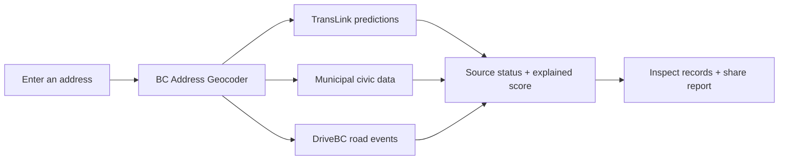

<div align="center">

# 🏙️ MetroPulse

### Know the block before you sign.

The listing shows the kitchen. **MetroPulse helps you investigate the neighborhood.**

[Explore the report](#-try-it-locally) · [Check coverage](#-where-does-it-work) · [See the roadmap](docs/IMPLEMENTATION_PLAN.md) · [Read the blueprint](docs/BLUEPRINT.md)

</div>

---

## 🔎 What would you want to know before moving in?

<details open>
<summary><strong>🚌 “What’s transit doing near this address?”</strong></summary>

Nearby stops, upcoming departure predictions, median predicted delay, and relevant service alerts. These describe current predictions, not months of measured reliability. Historical analysis is on the roadmap.

</details>

<details>
<summary><strong>🏗️ “What’s going on next door?”</strong></summary>

Inspect returned building permits, service requests, and active DriveBC road events, with dates and distances where available. A permit is a clue to investigate, not proof that construction is active. Civic status/date filtering and completeness checks still need work.

</details>

<details>
<summary><strong>🏠 “Are there rental building issues nearby?”</strong></summary>

Vancouver’s rental-standards records provide another question to ask before signing. Expand records in the report to inspect the available details. Nearby issues do not establish a violation at the specific building you searched.

</details>

<details>
<summary><strong>🧭 “Can I trust the score?”</strong></summary>

Every component explains its contribution. Missing sources lose their weight; the composite is withheld unless more than half the original weight is available. Disruption requires both service-request and road-event data.

The Pulse Score is an experimental summary of available signals, not a guarantee about an address. Start with the evidence beneath it.

</details>

## 🚀 Try it locally

Use **Node 22.6+** for the TypeScript scripts. A current Node 22 release is recommended.

```bash
npm ci
npm test
npm run typecheck
npm run build
```

In one terminal, start the API:

```bash
TRANSLINK_API_KEY=your-key npm run dev:api
```

In another, start the app:

```bash
npm run dev
```

Open [localhost:3000](http://localhost:3000), enter an address, and expand the nearby records. The address report is the default screen. Shared reports use `/report/<address-slug>`.

> **Transit setup:** the included ten-stop sample uses placeholder IDs. Generate the real stop index below to match live predictions. Without a TransLink key, transit predictions are unavailable; the rest of the report can still show available data.

<details>
<summary><strong>Try the API directly</strong></summary>

```bash
curl 'http://localhost:8787/api/pulse?address=555+W+Hastings+St+Vancouver'
curl 'http://localhost:8787/api/pulse?lat=49.2827&lng=-123.1207&radius=600'
curl 'http://localhost:8787/api/health'
```

Each source reports `ok`, `stale`, `error`, or `skipped`. Civic/transit failures can produce a partial `200` response with a withheld score. Invalid input and address-resolution failures have separate error responses.

Coordinates currently lack municipality resolution, so civic categories are skipped for coordinate-only queries. Use a street address for the fullest report.

</details>

## 📍 Where does it work?

These are implemented adapters, **not a live availability guarantee**. Upstream endpoints and fields must be verified before launch.

| Location | Transit¹ | DriveBC roads | 311 requests | Permits | Rental standards |
| --- | --- | --- | --- | --- | --- |
| Vancouver | ✓ | ✓ | ✓ | ✓ | ✓ |
| Surrey | ✓ | ✓ | — | ✓ | — |
| Burnaby | ✓ | ✓ | — | ✓ | — |
| Other Metro Vancouver locations | ✓ | ✓ | — | — | — |

¹ Transit requires a working API key and real stop index. DriveBC coverage does not include every local road closure. “—” means no adapter yet. Missing data appears as unavailable, rather than a reassuring zero.

## ⚙️ One address → one report



| Want to explore… | Start here |
| --- | --- |
| The address report | [`src/components/LiveDemo.tsx`](src/components/LiveDemo.tsx) |
| How sources are combined | [`src/server/pulse.ts`](src/server/pulse.ts) |
| Score calculations | [`src/server/score.ts`](src/server/score.ts) |
| The transit archive | [`scripts/snapshot.ts`](scripts/snapshot.ts) |
| What happens next | [Implementation plan](docs/IMPLEMENTATION_PLAN.md) |

## 🛠️ Open the toolbox

<details>
<summary><strong>Build the real transit stop index</strong></summary>

```bash
curl -fL https://gtfs-static.translink.ca/gtfs/google_transit.zip -o /tmp/gtfs.zip
unzip -o -d /tmp/gtfs /tmp/gtfs.zip stops.txt
npm run build:stops /tmp/gtfs/stops.txt data/stops.csv
STOP_INDEX_PATH=data/stops.csv TRANSLINK_API_KEY=your-key npm run dev:api
```

Refresh the index when static GTFS changes. Cloudflare Workers need an HTTPS URL to the generated CSV; local file paths only work with the Node API.

</details>

<details>
<summary><strong>Configuration</strong></summary>

| Variable | Purpose |
| --- | --- |
| `TRANSLINK_API_KEY` | Required for transit predictions and alerts |
| `BC_GEOCODER_API_KEY` | Optional DataBC key for higher rate limits |
| `STOP_INDEX_PATH` | Local CSV or hosted HTTPS URL for real stop IDs |
| `DEFAULT_RADIUS_M` / `MAX_RADIUS_M` | Search radius bounds; defaults 800 / 2000 |
| `FANOUT_BUDGET_MS` | Upstream fan-out budget; default 6000 ms |
| `SUPABASE_URL` / `SUPABASE_SERVICE_KEY` | Durable transit archive storage |

Upstream URLs and dataset IDs are overridable in [`config.ts`](src/server/config.ts). Environment variables must be supplied to the process; the scripts do not automatically load `.env` files. Never expose the Supabase service key in frontend code.

</details>

<details>
<summary><strong>Check sources before launch</strong></summary>

```bash
npm run verify:sources
```

This currently checks reachability and nonempty responses. It does not validate field mappings, count completeness, or score accuracy. The test suite uses fixtures and does not establish live provider availability.

</details>

<details>
<summary><strong>Deploy to Cloudflare Workers</strong></summary>

Set `STOP_INDEX_PATH` in [`wrangler.jsonc`](wrangler.jsonc) to a hosted real stop index and configure the API secret:

```bash
npx wrangler secret put TRANSLINK_API_KEY
npm run deploy:dry
npm run deploy
```

For Git-integrated deployments, use `npm run build` as the build command and `npx wrangler deploy` as the deploy command. The Worker serves the Vite assets and API together.

</details>

<details>
<summary><strong>Collect transit history</strong></summary>

[`snapshot.yml`](.github/workflows/snapshot.yml) polls every five minutes on GitHub Actions using Node 22. Configure repository secrets `TRANSLINK_API_KEY`, `SUPABASE_URL`, and `SUPABASE_SERVICE_KEY`; scheduled runs fail if durable storage is missing.

Local snapshot runs can still use JSONL for development:

```bash
TRANSLINK_API_KEY=your-key node --experimental-strip-types scripts/snapshot.ts
```

Before production collection: finish archive identity, database access protection, rollups, and gap monitoring in the [plan](docs/IMPLEMENTATION_PLAN.md). GitHub cron is best-effort and cannot provide a continuous 30-second archive.

</details>

## 🌱 What’s next?

- [x] Address search as the default screen
- [x] Explained scores and source attribution
- [x] Inspectable civic records and explicit unavailable states
- [x] Transit-choice and half-coverage scoring regression fixes
- [ ] Validated provider schemas, status/date filters, and complete counts
- [ ] Automated real stop-index refresh and municipality lookup for coordinates
- [ ] Reliable historical aggregates and collection monitoring
- [ ] Filterable activity map
- [ ] Saved addresses and commute-watch digests

Follow the [implementation plan](docs/IMPLEMENTATION_PLAN.md) for dependencies and acceptance criteria. The legacy presentation tabs remain available as project background and still need their older outing-focused content updated.

## 🤝 Built on public data

Reports display provider attribution. Most civic sources use open-government licences; TransLink has its own Open API Terms of Use. Review applicable terms before commercial use.

**A better-informed question before signing is already a better start.**
